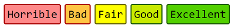

# Data Structures and Algorithms
> This repo contains my implementations of several data structures and algorithms in C. You are free
> to use these programs wherever you want without permission. This comes without any warranties
> though!

-------------------------------------------------------

## Table of Contents
* [Legend](#legend)
* [1.0. Data Structures](#10-data-structures)
  * [1.1. Linear Data Structures](#11-linear-data-structures)
    * [1.1.1. Single Linked List](#111-single-linked-list)
    * [1.1.1. Queue](#112-queue)
    * [1.1.1. Stack](#113-stack)
  * [1.2. Non-Linear Data Structures](#12-non-linear-data-structures)
    * [1.2.1 Graphs](#121-graphs)
    * [1.2.1 Trees](#122-trees)
* [2.0. Algorithms](#20-algorithms)
  * [2.1. Sorting Algorithms](#21-sorting-algorithms)
    * [2.1.1. Heap Sort](#211-heap-sort)
    * [2.1.2. Merge Sort](#211-merge-sort)
    * [2.1.3. Quick Sort](#211-quick-sort)
    * [2.1.4. Radix Sort](#211-radix-sort)
  * [2.2. Searching Algorithms](#21-searching-algorithms)

-------------------------------------------------------

## Legend


-------------------------------------------------------

## 1.0. Data Structures
Data strcutures are a way of handling complex data in a language. They are built upon the language's
native datatypes to provide ways to handle data that the language doesn't provide by default.

Data structures can be briefly classified into two types based on how they are allocated in the
system memory.

Data structures can be implemented either by using built-in arrays or a using a group of nodes.

```
// Arrays
┌───┬───┬───┬───┬───┐
│ A │ B │ C │ D │ E │
└───┴───┴───┴───┴───┘
  0   1   2   3   4

// Nodes
┌─────┬───┐    ┌─────┬───┐    ┌─────┬───┐
│  A  │ ╾─┼────┾  B  │ ╾─┼────┾  C  │ ╳ │
└─────┴───┘    └─────┴───┘    └─────┴───┘
   1483            2146           4738
```

### 1.1. Linear Data Structures
Linear data structures can be represented as they are linear in nature.

#### 1.1.1. Single Linked List
Single linked list are a group of nodes that have only a single pointer that points to the next node
in the list.

```
// A single linked list
┌─────┬───┐    ┌─────┬───┐    ┌─────┬───┐
│  A  │ ╾─┼────┾  B  │ ╾─┼────┾  C  │ ╳ │
└─────┴───┘    └─────┴───┘    └─────┴───┘
   1483            2146           4738
```

-------------------------------------------------------

## License
MIT
